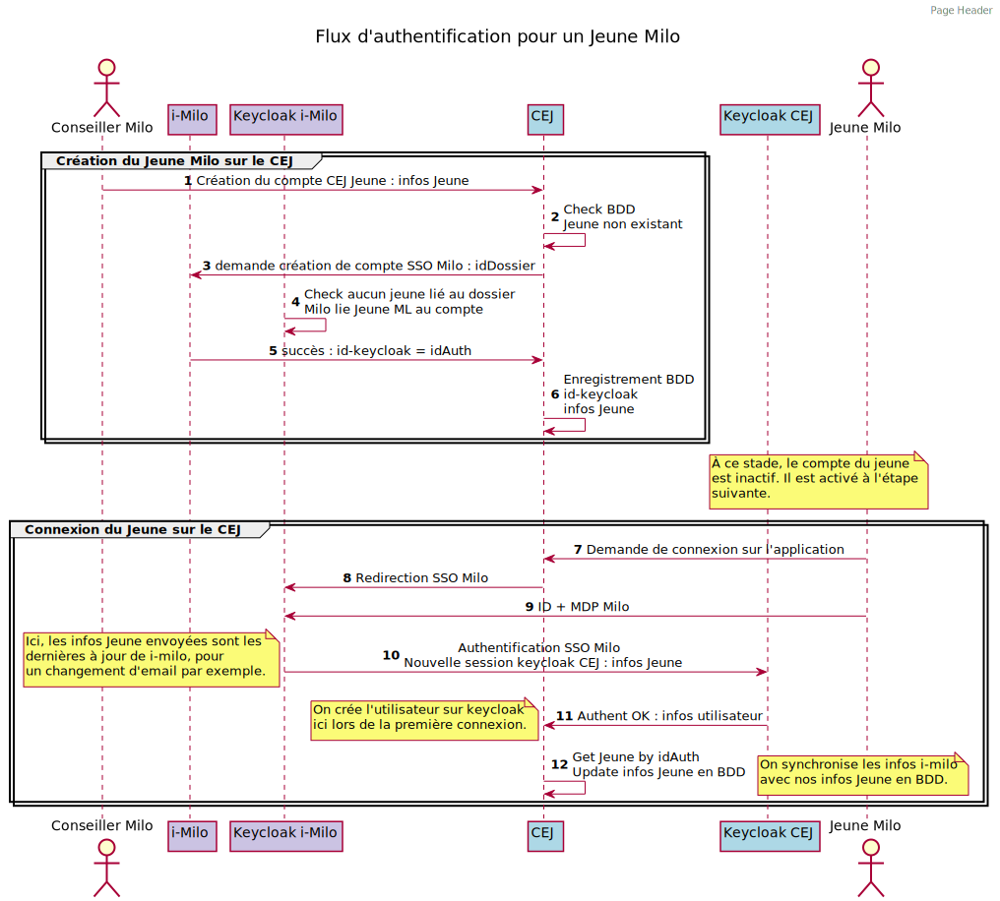
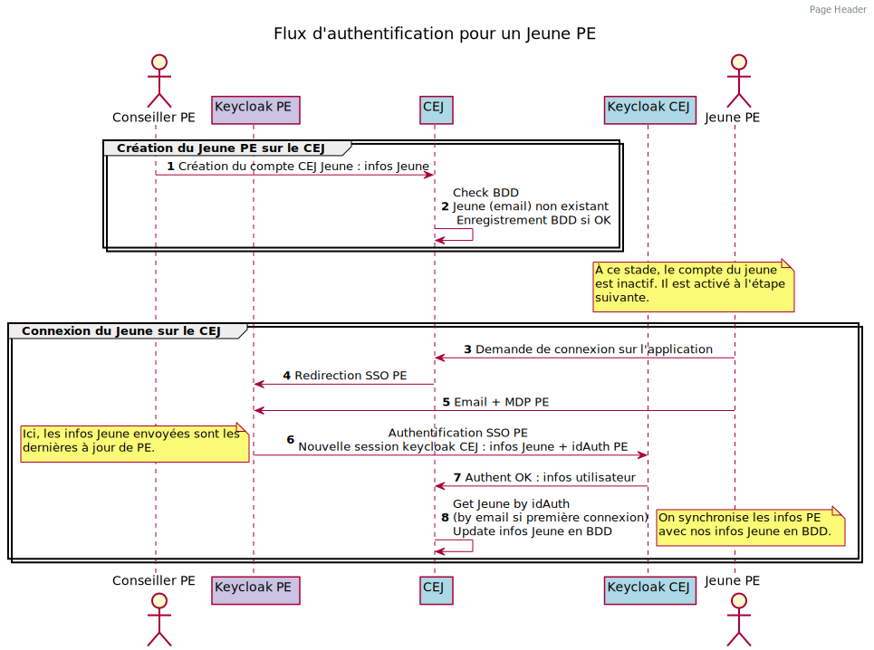

# Contribuer

Voir [CONTRIBUTING.md](docs/CONTRIBUTING.md)

# Liens utiles

- Support Prod : [Guide Notion & Planning](https://www.notion.so/fabnummas/Support-tech-c71a6222c7c54f8490060413c96471db)
- [Suivi des routes](https://docs.google.com/spreadsheets/d/1B_wcz8itdTZFzeOxE3u8MEcTb95Vc-75PwiiuzbkREs/edit#gid=2092898073)
- [Swagger Staging](https://api.pass-emploi.incubateur.net/documentation/)
- [Swagger Prod](https://api.pass-emploi.beta.gouv.fr/documentation/)

# Flux d'authentification

Le flux Milo a été revu sur à l'[ADR-002](docs/decisions/ADR-002-keycloak-creation-jeune-milo.md).

