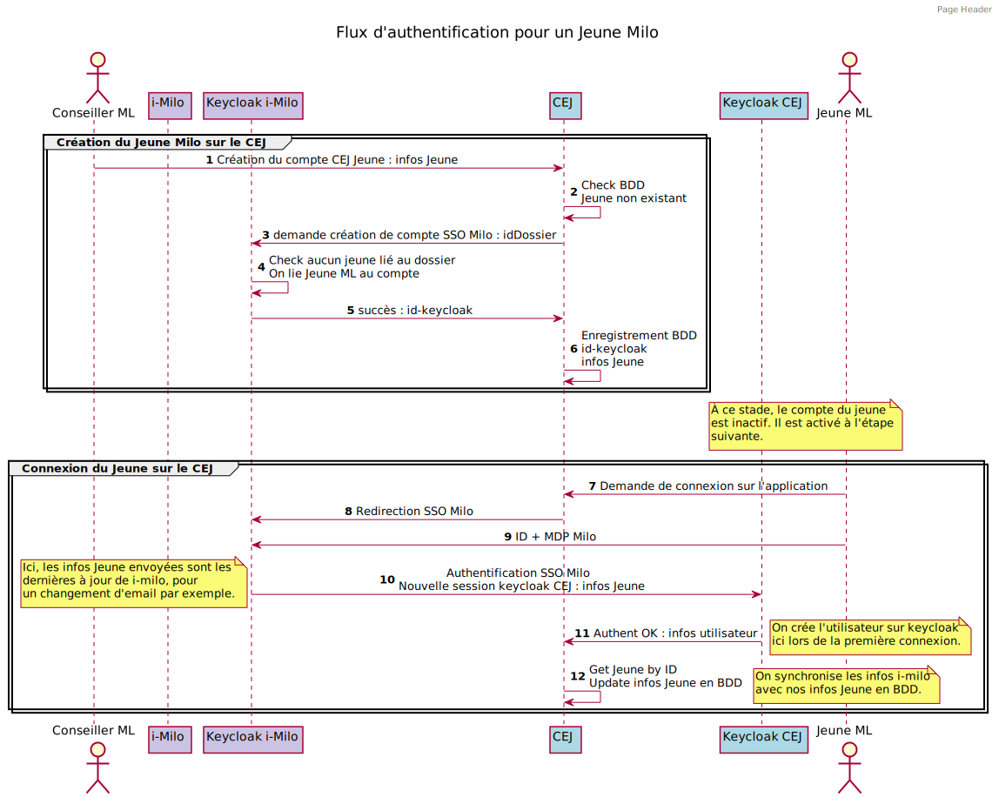
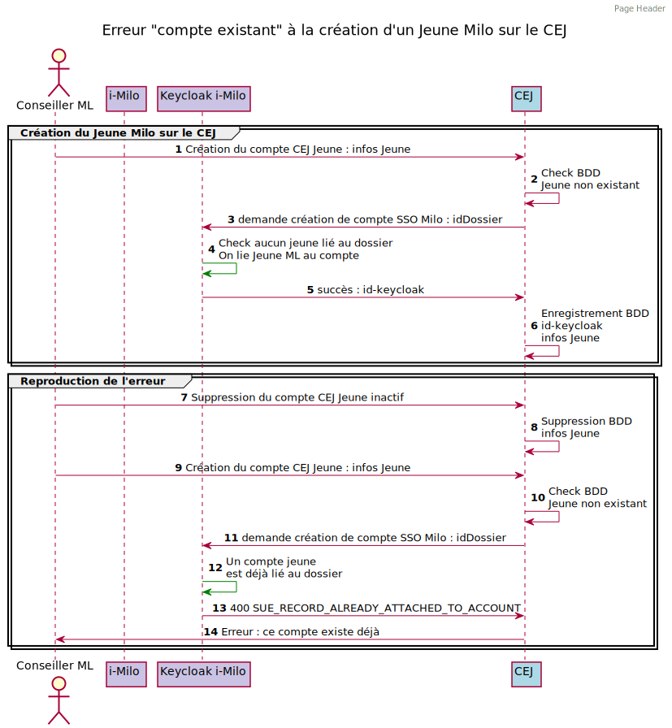
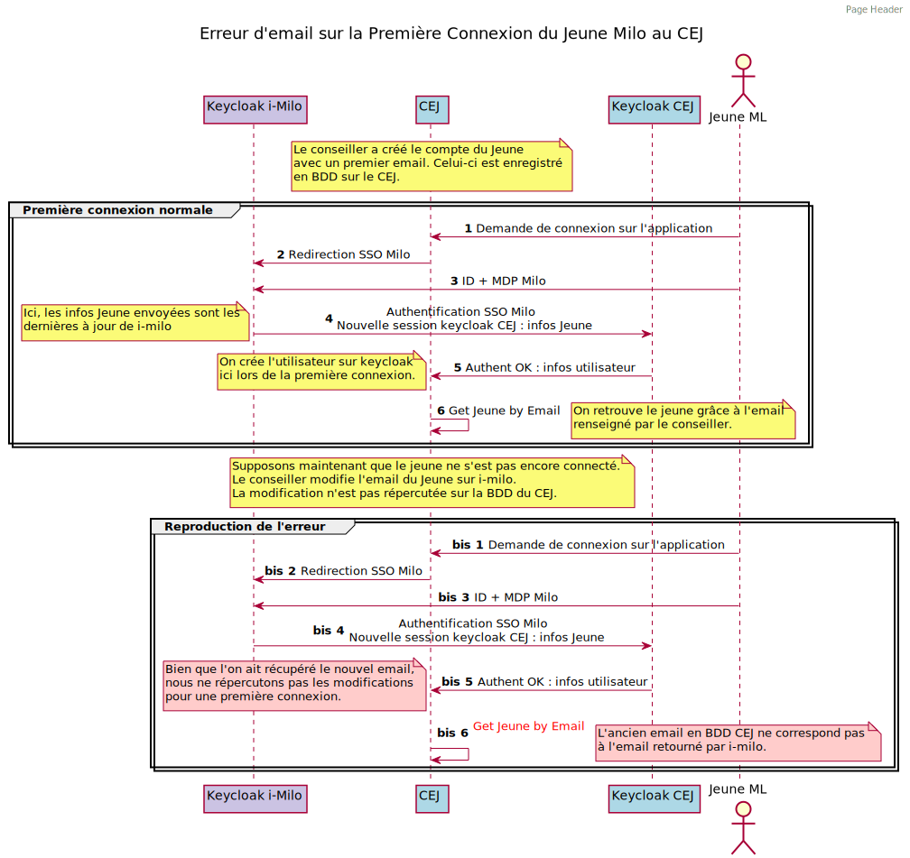

# [titre du problème résolu et de sa solution]

* Statut: proposé
* Décideurs: team back
* Date: 2022-06-20

Ticket Trello / Notion:
- [Créer un deuxième compte jeune Milo avec le même sub id](https://www.notion.so/fabnummas/N-recr-e-un-deuxi-me-compte-jeune-milo-avec-le-m-me-sub-ID-f6b04167d1a94a14913342cad9949fff)
- [Modification de la création de jeune i-milo](https://www.notion.so/fabnummas/Modification-de-la-cr-ation-de-jeune-i-milo-a69e0cca67a54ab1a65e9beddc47a9fc)

## Contexte et Définition du Problème

La décision concerne le flux d'authentification schématisé ci-dessous. Les changements ont été effectués aux étapes *6* et *12* du flux.

### Conseiller ML : Je ne peux pas recréer un deuxième compte CEJ jeune après avoir supprimé le premier inactif

- Cette douleur se traduit sur le support par la remontée de tickets demandant la **double suppression** des infos du Jeune sur le backoffice CEJ et le keycloak i-milo.
- L'origine du problème vient du mauvais traitement de l'erreur 400 *SUE_RECORD_ALREADY_ATTACHED_TO_ACCOUNT* retournée par le keycloak i-milo à l'étape *5* du flux d'authentification.

### Jeune ML : Je n'arrive pas à faire ma première connexion à l'appli si le conseiller a modifié mon email i-milo
   - Ce problème se répercute sur le support. Il doit gérer les tickets signalant des problèmes de première connexion du jeune.
   - Les problèmes de connexion arrivent lorsque le conseiller modifie l'adresse email du jeune avant sa première connexion.
   - Dans le code, lors de la création du compte jeune, l'id-keycloak n'était pas enregistré, on se basait donc sur l'ancien email pour retrouver le jeune en BDD.

## Résultat de la Décision

Solution retenue:
- Étape 6 : Branchement conditionnel pour le traitement de l'erreur "idDossier déjà associé à un compte jeune". Nous pouvons désormais distinguer le cas "Le jeune existe chez Milo et chez le CEJ" avec le cas "Le jeune existe chez Milo mais pas chez le CEJ"
- Étape 12 : Modification de la source de vérité à la première connexion email. Nous enregistrons maintenant l'id-keycloak à la création du jeune et le réutilisons pour retrouver le jeune à la première connexion.

### Impacts Positifs

* Décharge du support pour les tickets sur la double suppression CEJ / keycloak i-milo
* Documentation du flux sur une zone d'ombre pour une partie de l'équipe et le support

